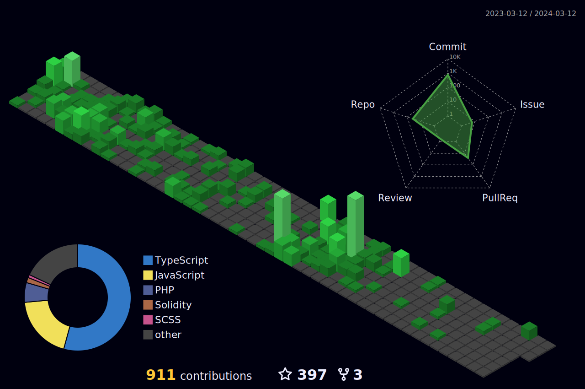

<center><h1>Super @lchemist</h1></center>


# About Me

Seasoned developer with hands-on experience of React, Angular, Vue, 2 years of finesse in Reactjs, and a year's expertise in Solidity.
And Also I am 3d Website & WebGL & Game Developer.
Architecting networks for a decade, sculpting database landscapes for 8 years, and weaving WordPress magic as a template and plugin creator for 8 years.
Dedicated to crafting elegant and scalable solutions.

# I am

```
  👨‍💻 Professional Software Engineer
  💻 Expert in Enterprise-Level Development with Web and Mobile Experience
  📈 Adherent to Agile Development Principles
  ⚡ Innovator in Design and Collaboration
  🤖 Proficient in AI and ML Integration
  🎯 Stay up-to-date with IT industry trends
```

# Skill Set
    🔹   Game: PixiJS, WebGL, Three.js, Babylon.js, Unity, Unreal ...
    🔹   Frontend: React, Vue, Angular, Next, Electron ...
    🔹   Backend: Node.js, Express.js, C++, Java, C#, .NET, Python, PHP...
    🔹   DB: PostgreSQL, MsSQL, MySql, Oracle, MongoDB...

# Languages and Tools

<div style="display: flex; align-items: flex-start; align-content: center">  
<table style="text-align: center;">  
  <tr> 
    <td align="center" width="80">  
      
      <br>HTML  
    </td>  
    <td align="center" width="80">  
        
      <br>CSS  
    </td> 
    <td align="center" width="80">  
        
      <br>Javascript  
    </td>
    <td align="center" width="80">  
        
      <br>TS  
    </td> 
    <td align="center" width="80">  
        
      <br>NodeJs  
    </td>   
    <td align="center" width="80" align="center" width="80">  
        
      <br>C++  
    </td>  
    <td align="center" width="80">  
        
      <br>C#  
    </td>
    <td align="center" width="80">  
        
      <br>Java  
    </td>  
    <td align="center" width="80">  
        
      <br>Python  
    </td> 
    <td align="center" width="80">  
        
      <br>PHP  
    </td>    
  </tr>  
  <!-- <tr>  
    <td align="center" width="80">  
          
      <br>TF  
    </td>  
    <td align="center" width="80">  
        
      <br>Cuda
    </td>  
    <td align="center" width="80">  
        
      <br>Keras  
    </td>  
    <td align="center" width="80">  
        
      <br>PyTorch  
    </td>  
    <td align="center" width="80">  
        
      <br>Caffe  
    </td>
    <td align="center" width="80">  
        
      <br>YOLO  
    </td>
        <td align="center" width="80">  
        
      <br>OpenCV  
    </td>    
    <td align="center" width="80">  
        
      <br>OpenAI  
    </td>  
    <td align="center" width="80">  
        
      <br>ALPR  
    </td>  
    <td align="center" width="80">  
        
      <br>Face 
    </td>  
  </tr>   -->
  <tr>  
    <td align="center" width="80">  
        
      <br>Express  
    </td>
    <td align="center" width="80">  
        
      <br>Nestjs  
    </td>
    <td align="center" width="80">  
        
      <br>Django  
    </td>
    <td align="center" width="80">  
        
      <br>Flask  
    </td>
    <td align="center" width="80">  
        
      <br>.Net  
    </td>
    <td align="center" width="80">  
        
      <br>Spring  
    </td>
    <td align="center" width="80">  
        
      <br>Hibernate  
    </td>
    <td align="center" width="80">  
        
      <br>WordPress  
    </td>
    <td align="center" width="80">  
        
      <br>CI  
    </td>
    <td align="center" width="80">  
        
      <br>Laravel  
    </td>
  </tr>
  <tr>  
    <td align="center" width="80">  
        
      <br>React  
    </td>
    <td align="center" width="80">  
        
      <br>Next  
    </td>
    <td align="center" width="80">  
        
      <br>Angular  
    </td>
    <td align="center" width="80">  
        
      <br>Vue  
    </td>
    <td align="center" width="80">  
        
      <br>Svelte  
    </td>
    <td align="center" width="80">  
        
      <br>Electron  
    </td>
    <td align="center" width="80">  
        
      <br>Alpinejs  
    </td>
    <td align="center" width="80">  
        
      <br>Tailwind  
    </td>
    <td align="center" width="80">  
        
      <br>Threejs  
    </td>
    <td align="center" width="80">  
        
      <br>BS  
    </td>
  </tr>
  <tr>  
    <td align="center" width="80">  
        
      <br>MySql  
    </td>
    <td align="center" width="80">  
        
      <br>PgSQL  
    </td>
    <td align="center" width="80">  
        
      <br>Mongo
    </td>
    <td align="center" width="80">  
        
      <br>Git  
    </td>
    <td align="center" width="80">  
        
      <br>GitHub  
    </td>
    <td align="center" width="80">  
        
      <br>Stack  
    </td>
    <td align="center" width="80">  
        
      <br>Docker  
    </td>
    <td align="center" width="80">  
        
      <br>Nginx  
    </td>
    <td align="center" width="80">  
        
      <br>AWS  
    </td>
    <td align="center" width="80">  
        
      <br>RP 
    </td>
  </tr>
</table>  
</div>

# 📊 GitHub Stats:

<!-- 
<br> -->


<!--
 -->
